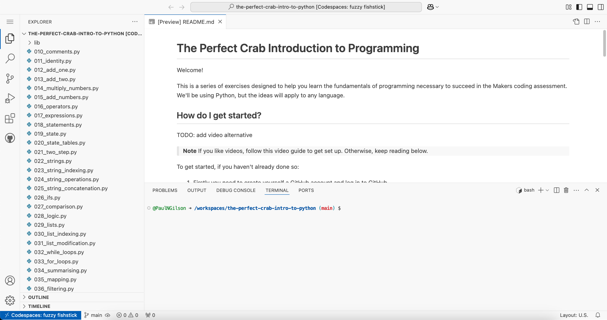

# The Perfect Crab Introduction to Programming

Welcome!

This is a series of exercises designed to help you learn the fundamentals of
programming necessary to succeed in the Makers coding assessment. We'll be using
Python, but the ideas will apply to any language.

## How do I get started?

> **Note**
> If you like videos, follow this [video
> guide](https://vimeo.com/1061335416/4f5eb4a48f) to get set up. Otherwise, keep
> reading below.

To get started, if you haven't already done so:

1. Firstly you need to create yourself a GitHub account and log in to GitHub.
2. Next, from the green 'Use this template' button on the right, click and
   choose 'Open in a codespace' from the drop-down menu. This will open up the
   programming interface you will use to learn.


3. After this, keep reading down the file for further instructions.

⚙️ **If you prefer to use your own local development setup**

If you're confident using your own local development setup and you have Python 3
installed, you can instead clone this repository and work through it that way.
However only do this if you are sure you know what you're doing.

## How do I use GitHub Codespaces?

Once you have opened your new codespace, you will see an interface which we will
call the IDE. It should look like this (although may have a different colour):



You will need to engage with three parts of it:

* The file panel on your left, working through the numbered files of code in order.
* The code panel (if you're in your codespace, that's this one you're reading
  this text from) where you'll read and write code.
* The terminal panel at the bottom, where you'll run code.

To set up and learn how to use the interface, please follow the [IDE setup
video](https://vimeo.com/1061335416/4f5eb4a48f).

If you find the default appearance hard to read, you can switch to a different
colour theme within the IDE.

1. From the cog icon labelled 'Manage' at the bottom left of the IDE, click
   Settings.
2. Under 'Workbench' > 'Apperance', scroll down to find 'Color Theme' and choose
   a different one from the provided list. I would recommend one of these:

* GitHub Light Default
* GitHub Dark Dimmed
* GitHub Dark Default

You can close the Settings tab once you've changed your theme - click the 'X' on
the tab to close it or other files, like you'd close tabs on a browser.

## How to read the material

The learning materials are files of code. They look a bit like this:

```python
def just_return_it(num):
  return num

# This is a function. A function is a reusable block of code.
```

The first two lines are code. This is what you will be learning how to create.

That last line starting with a `#` is a comment. We will talk you through the
ideas behind the code using comments.

You should work through each file sequentially, starting with `010_comments.py`.
You should work through each file top to bottom.

At the end of the material there are four optional files. You don't need to
complete these to be ready for the assessment, but they might help.

## What if I would prefer to watch than to read?

There are video alternatives for each file that you can follow along with. You
can find them as a link at the top of each file.

## GitHub Codespaces

GitHub Codespaces is owned and managed by GitHub, not Makers - we have just
chosen to use their platform. There are a generous free number of hours of usage
per month, and the 60 hours of free usage you would get on The Perfect Crab
Introduction to Programming course is more than enough to complete it. You
absolutely do not need to pay for more usage to complete the Makers course,
although of course if you want to use Github Codespaces for other things apart
from this, that is up to you.

You can view your [account's current usage under
"Codespaces"](https://github.com/settings/billing/summary), so you can keep an
eye on how many hours you've used, should you wish.

Please be aware that if you do provide payment information to GitHub, and set a
non-zero limit on your spending, and use any GitHub Codespace for many hours,
you can personally be charged so by proceeding you do so at your own risk with
this understanding. For more information on GitHub Codespaces and paying for
usage, please consult GitHub's own documentation for the latest details.

## I have some feedback about the material

We would receive it with gratitude. [You can give us feedback
here.](https://forms.gle/Vo76eDCGRrWngWkD7)
